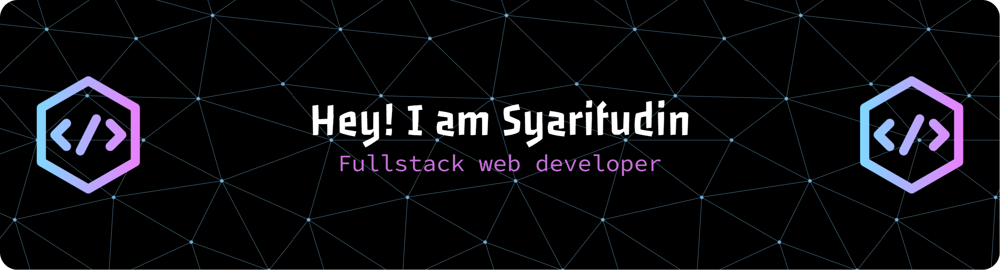

## Hello I'm Muhammad Syarifudin Hidayat 👋👋

#### My Skill

  
  
  
  
  
  
  
  
  
  
  
  
  
  

##### Connect with me

  
  
  

##### My Github Statistics

  

    
  

###

<picture>
  <source media="(prefers-color-scheme: dark)" srcset="https://raw.githubusercontent.com/sarephidayat/sarephidayat/output/pacman-contribution-graph-dark.svg">
  <source media="(prefers-color-scheme: light)" srcset="https://raw.githubusercontent.com/sarephidayat/sarephidayat/output/pacman-contribution-graph.svg">
  
</picture>

###

👋 Hi, I’m Muhammad Syarifudin Hidayat, currently learning programming and a student at Universitas Islam Negeri Walisongo Semarang. I'm eager to delve deeper into the world of programming and explore various opportunities in the field.

🌱 I'm actively seeking collaboration opportunities to gain practical experience and contribute to meaningful projects.

💼 Let's connect and collaborate:

- 📧 Email: hidayatsyarifudin903@gmail.com
- 💼 LinkedIn: Muhammad Syarifudin Hidayat
- 📸 Instagram: @sarephidayatt\_
- 📱 WhatsApp: +6289529684820

<h1 align="center">Hey 👋What's Up?</h1>

###

  
  
  
  
  
  
  
  
  
  
  
  
  
  
  
  
  
  
  

###

  
  
  
  
  

###

  
  

###

<picture>
  <source media="(prefers-color-scheme: dark)" srcset="https://raw.githubusercontent.com/maurodesouza/maurodesouza/output/pacman-contribution-graph-dark.svg">
  <source media="(prefers-color-scheme: light)" srcset="https://raw.githubusercontent.com/maurodesouza/maurodesouza/output/pacman-contribution-graph.svg">
  
</picture>

###
